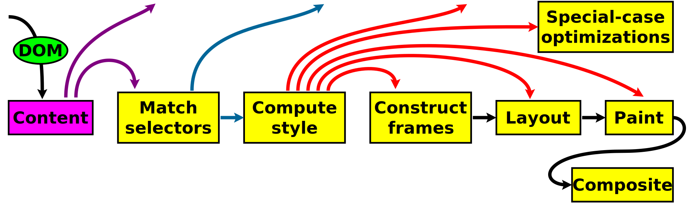

# How browser rendering works #

by [L. David Baron](http://dbaron.org)

 This work is licensed under a <a rel="license" href="http://creativecommons.org/licenses/by-sa/3.0/">Creative Commons Attribution-ShareAlike 3.0 Unported License</a>.

This is the story of how Web browsers work.  Really, it's just about how a part of Web browsers work:  what I'll call the rendering pipeline.  There are many other interesting parts of Web browsers.  Browsers download resources from the network and do crytography.  Browsers parse HTML into a DOM tree (or content tree), which is just an in-memory representation of the tree structure that the HTML markup represents.  Browsers execute JavaScript, which is a programming language, and allow that JavaScript to call APIs that are part of the Web platform.

What I call the rendering pipeline is about what happens between that DOM tree and the screen.  This is the story of how CSS style sheets are processed, how the DOM tree is combined with those style sheets to build a rendering tree (or box tree), how the positions and sizes of the nodes in that tree are calculated, and how the result is painted to the screen.  It is the story of how all of those pieces are optimized so that it's possible to build efficient applications.

This story is written for people who develop applications on the Web platform.  While the Web platform was originally designed for documents, it has evolved into a platform for applications.  My hope is that understanding how the rendering pipeline works will help authors understand how to build more efficient applications:  applications that run faster, respond faster, and use less power.

Before I begin, though, I should make a brief note about my perspective.  I work on Gecko, the layout engine used in Firefox and other [Mozilla](https://www.mozilla.org/) products, which is one of the three major layout engines for Web browsers being actively developed today.  The other two are [WebKit](http://www.webkit.org/), which is used in Safari and Chrome, and [Trident](http://en.wikipedia.org/wiki/Trident_%28layout_engine%29), which is used in Microsoft Internet Explorer.  Many of the things I say here apply across layout engines, but quite a few are specific to Gecko, and I don't always know which are which, though I attempt to be clear when I do.

## Hosting this document on github was an experiment that failed, due to inability to use SVG in markdown.  I need to find a new home for it.  Sorry.  (Though, maybe I should try github-pages; see [GitHub Pages](https://help.github.com/articles/what-are-github-pages/) and [Tab's blog post](http://www.xanthir.com/b4Zz0).

## The rendering pipeline without optimization ##

### Parsing

<table border="border" width="100%">

<tbody><tr><td width="50%">

</td>

<td width="50%">

</td></tr></tbody>
</table>

<svg xmlns="http://www.w3.org/2000/svg" style="display:block; height: 100%; width: 100%; font-size: 80px; stroke-width: 5px;" preserveAspectRatio="xMidYMin meet"
     viewBox="0 0 1700 1400">
	<rect x="0" y="0" width="1500" height="1000" fill="white" />
	<g style="stroke-width: 10px; stroke: black;">
		<line x1="750" y1="100" x2="300" y2="300" />
		<line x1="750" y1="100" x2="900" y2="300" />
		<line x1="300" y1="300" x2="300" y2="500" />
		<line x1="300" y1="500" x2="300" y2="700" />
		<line x1="900" y1="300" x2="900" y2="500" />
		<line x1="900" y1="500" x2="700" y2="700" />
		<line x1="900" y1="500" x2="1100" y2="700" />
		<line x1="350" y1="900" x2="700" y2="700" />
		<line x1="1100" y1="700" x2="900" y2="900" />
		<line x1="1100" y1="700" x2="1300" y2="900" />
		<line x1="1300" y1="900" x2="1000" y2="1100" />
		<line x1="1300" y1="900" x2="1500" y2="1100" />
		<line x1="1500" y1="1100" x2="1400" y2="1300" />
	</g>

	<ellipse cx="750" cy="100" rx="2em" ry="0.8em" fill="aqua" stroke="black" />
	<text x="750" y="100" text-anchor="middle" dominant-baseline="middle">html</text>

	<ellipse cx="300" cy="300" rx="2em" ry="0.8em" fill="aqua" stroke="black" />
	<text x="300" y="300" text-anchor="middle" dominant-baseline="middle">head</text>

	<ellipse cx="900" cy="300" rx="2em" ry="0.8em" fill="aqua" stroke="black" />
	<text x="900" y="300" text-anchor="middle" dominant-baseline="middle">body</text>

	<ellipse cx="300" cy="500" rx="2em" ry="0.8em" fill="aqua" stroke="black" />
	<text x="300" y="500" text-anchor="middle" dominant-baseline="middle">title</text>

	<ellipse cx="300" cy="700" rx="3.5em" ry="0.8em" fill="yellow" stroke="black" />
	<text x="300" y="700" text-anchor="middle" dominant-baseline="middle">"Web p..."</text>

	<ellipse cx="900" cy="500" rx="1.5em" ry="0.8em" fill="aqua" stroke="black" />
	<text x="900" y="500" text-anchor="middle" dominant-baseline="middle">div</text>

	<ellipse cx="700" cy="700" rx="1em" ry="0.8em" fill="aqua" stroke="black" />
	<text x="700" y="700" text-anchor="middle" dominant-baseline="middle">h1</text>

	<ellipse cx="350" cy="900" rx="3.5em" ry="0.8em" fill="yellow" stroke="black" />
	<text x="350" y="900" text-anchor="middle" dominant-baseline="middle">"Web p..."</text>

	<ellipse cx="1100" cy="700" rx="2em" ry="0.8em" fill="lime" stroke="black" />
	<text x="1100" y="700" text-anchor="middle" dominant-baseline="middle">svg</text>

	<ellipse cx="900" cy="900" rx="2em" ry="0.8em" fill="lime" stroke="black" />
	<text x="900" y="900" text-anchor="middle" dominant-baseline="middle">line</text>

	<ellipse cx="1300" cy="900" rx="1em" ry="0.8em" fill="lime" stroke="black" />
	<text x="1300" y="900" text-anchor="middle" dominant-baseline="middle">g</text>

	<ellipse cx="1000" cy="1100" rx="3em" ry="0.8em" fill="lime" stroke="black" />
	<text x="1000" y="1100" text-anchor="middle" dominant-baseline="middle">ellipse</text>

	<ellipse cx="1500" cy="1100" rx="2em" ry="0.8em" fill="lime" stroke="black" />
	<text x="1500" y="1100" text-anchor="middle" dominant-baseline="middle">text</text>

	<ellipse cx="1400" cy="1300" rx="3.5em" ry="0.8em" fill="yellow" stroke="black" />
	<text x="1400" y="1300" text-anchor="middle" dominant-baseline="middle">"This..."</text>

</svg>

### Style computation

### Rendering tree construction

### Layout

### Painting

## Optimizations ##

TODO: Unoptimized view of world:  redo everything for each DOM or style change

TODO: (Alternate view:  cache nothing, and redo everything each repaint)

TODO: optimizations can and do change

### Optimization: skipping stages of the pipeline

<pre>
&lt;script&gt;
  div.setAttribute("data-rating", "excellent");
&lt;/script&gt;
</pre>

Browsers can check whether there are selectors that care about this attribute, and as a result not even compute style.

<pre>
&lt;script&gt;
  div.setAttribute("data-rating", "excellent");
&lt;/script&gt;
&lt;style&gt;
  #list div[data-rating="excellent"] {
    background: yellow; color: black;
  }
&lt;/style&gt;
</pre>

Now there are selectors, so we have to rerun selector matching.  But if the div isn't inside an element with <code>id="list"</code>, nothing changed.

<pre>
&lt;script&gt;
  div.setAttribute("data-rating", "excellent");
&lt;/script&gt;
&lt;style&gt;
  div[data-rating="excellent"] {
    background: yellow; color: black;
  }
&lt;/style&gt;
</pre>

Now the rerunning of selector matching actually makes a new rule match that didn't before.

* Some properties that make us reconstruct frames / rendering objects:
* * display
* * position
* * float (from/to 'none')
* * transform (from/to 'none')
* * column-*
* * counter-*
* * quotes
* Some properties that make us reflow / lay out again
* * width
* * height
* * font-*
* * margin-*
* * padding-*
* * border-*-width
* * letter-spacing
* * word-spacing
* * line-height
* Some properties that make us repaint
* * color
* * background-*
* * border-*-color
* * z-index
* Some properties that have custom optimizations
* * transform
* * cursor

Or maybe nothing changed:

<pre>
p { background: yellow }
p:hover { background: yellow }
</pre>

TODO: write

### Optimization: skipping part of a stage

TODO: describe stage-specific optimizations

Skipping part of frame construction / rendering tree construction:
* Reconstructing a frame implies reconstructing all its descendants
* There's a tiny cost resulting from the depth of the tree it's in
* Otherwise cost is mostly proportional to the number of boxes / frames / rendering objects constructed

<pre>&lt;script&gt;
/* likely Gecko-specific */
function flush_frames(elt)
  { getComputedStyle(elt, "").color; }
var start = Date.now();
for (var i = 0; i &lt; 10000; ++i) {
  test_elt.style.display = "none";
  flush_frames(test_elt);
  test_elt.style.display = "";
  flush_frames(test_elt);
}
var time = (Date.now() - start);
&lt;/script&gt;</pre>

Skipping part of reflow:
* When layout of one element changes, it can move others around
* Reflow / re-layout runs from the top of the tree down to the things it needs to change
* intrinsic width computation a separate issue
* Some properties force relayout of all descendants; some don't
* So cost of layout depends on surroundings
* Experiment with surroundings.

<pre>&lt;script&gt;
function flush_layout(elt) { elt.offsetTop; }
var start = Date.now();
for (var i = 0; i &lt; 10000; ++i) {
  test_elt.style.fontSize = "1px"; /* or width */
  flush_frames(test_elt);
  test_elt.style.fontSize = ""; /* or width */
  flush_frames(test_elt);
}
var time = (Date.now() - start);
&lt;/script&gt;</pre>

<!--
FIXME: ADD FIGURE
-->

Skipping part of painting:
* Repainting an area is about painting a rectangle.
* Harder to measure because browser controls refresh rate
* Some ways to spot very bad cases, but vary based on OS and browser
  <!-- FIXME: better? -->

### coalescing multiple runs (both general and stage-specific)

TODO: talk about screen refresh rates

Authors might change the same element twice:
<pre>element.style.position = "absolute";
element.style.overflow = "auto";</pre>

Authors might make changes where the work needed to handle one subsumes the work for the other:
<pre>element.style.backgroundColor = "blue";
element.parentNode.style.opacity = "0.8";</pre>

Browsers don't actually process the changes until:
* It's time to redraw
* Script asks for something (e.g., style, positions, sizes) that requires processing them

some things that flush style / frame construction:
* getComputedStyle(element, "").color
(Maybe Gecko-specific; might only flush style)

some things that flush layout:
* getComputedStyle(element, "").width
* element.offsetTop

DO NOT DO THIS:
<pre>for (var i = 0; i &lt; n; ++i) {
  var photo = document.getElementById("photo" + i);
  var label = document.getElementById("label" + i);
  label.style.top = photo.offsetHeight + "px";
}</pre>
These can sometimes be hidden in frameworks.

### low-level optimizations

TODO: Is this even a good section title?

TODO: better algorithms, better parallelism (e.g., GPU)

TODO: figure out how I want to talk about graphics acceleration (e.g., if it fits in this structure).  Talk about:
- using capabilities of the hardware
- doing drawing operations to a surface using its capabilities at some level of abstraction
- caching (surfaces, patterns, etc.)

## Further material

Since I haven't made much progress on writing this so far, it's worth noting that one of my main sources of the content above is a talk I gave at SXSW on 2012-03-11 into written form.  This talk was /Fast CSS: How Browsers Lay Out Web Pages/: <a href="http://dbaron.org/talks/2012-03-11-sxsw/slide-1.xhtml">slideshow</a>, <a href="http://dbaron.org/talks/2012-03-11-sxsw/master.xhtml">all slides</a>, <a href="http://audio.sxsw.com/2012/podcasts/11-ACC-Fast_CSS_How_Browser_Layout.mp3">audio (MP3)</a>, <a href="http://schedule.sxsw.com/2012/events/event_IAP12909">Session page</a>, <a href="http://lanyrd.com/2012/sxsw-interactive/spmbt/">Lanyrd page</a>.
